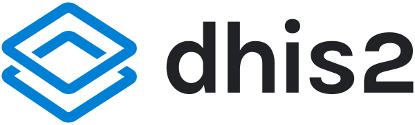
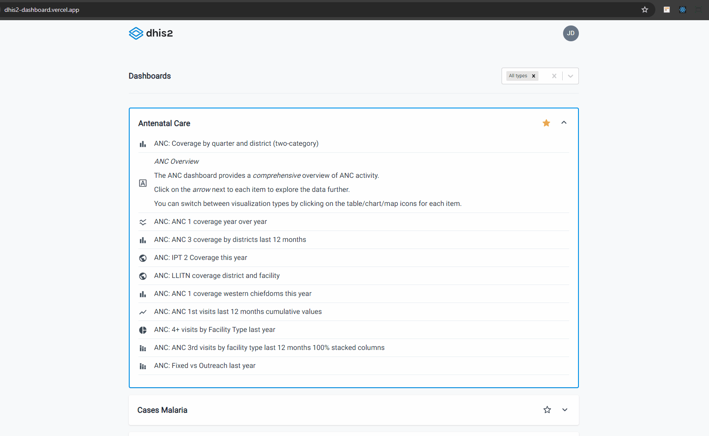

<p align="center">
  
</p>

<p align="center">
  <strong>
    A list of dashboards available to a DHIS2 user.
  </strong>
</p>

<p align="center">
  
</p>

<p>&nbsp;</p>

> [!NOTE]
> 👉🏻 Access: [https://dhis2-dashboard.vercel.app/](https://dhis2-dashboard.vercel.app/)

<p>&nbsp;</p>

<p align="center">
  

  

  
</p>

<p align="center">
  <a href="#features">Features</a>&nbsp;&nbsp;&nbsp;|&nbsp;&nbsp;&nbsp;
  <a href="#heavy_check_mark-settings">Settings</a>&nbsp;&nbsp;&nbsp;|&nbsp;&nbsp;&nbsp;
  <a href="#arrow_down_small-cloning-the-repository">Cloning the repository</a>&nbsp;&nbsp;&nbsp;|&nbsp;&nbsp;&nbsp;
  <a href="#beginner-starting-the-application">Starting the application</a>&nbsp;&nbsp;&nbsp;|&nbsp;&nbsp;&nbsp;
  <a href="#wrench-techs--tools--resources">Techs | Tools | Resources</a>&nbsp;&nbsp;&nbsp;|&nbsp;&nbsp;&nbsp;
  <a href="#memo-license">License</a>
</p>

### Context

As a requirement of the technical assessment instructions the library used in this project was React using the Next.js framework. Currently, the React's team recommends choosing one of the frameworks popular in the community:

> If you want to build a new app or a new website fully with React, we recommend picking one of the React-powered frameworks popular in the community. Frameworks provide features that most apps and sites eventually need, including routing, data fetching, and generating HTML.

I've used TypeScript because you can save time by avoiding bugs due to typos and other errors, it offers faster performance and the IntelliSense works better, generating a superior developer experience.

And I've chosen the Radix UI because its optimization related to accessibility.

### Features

#### Done

- List of dashboards fetched from the API;
- Details of a specific dashboard when the dashboard card is expanded;
- Ability to filter dashboard items of a centain type;
- Ability to "star" a dashboard;
- Responsive page.

#### Todo

- Add tests.

### :heavy_check_mark: Settings

The settings to execute the application on your computer are listed below.

- [Git](https://git-scm.com);
- [Node](https://nodejs.org/);
- [Yarn](https://yarnpkg.com/).

### :arrow_down_small: Cloning the repository

1. Through the terminal, go to the directory where you want to have the repository cloned and run the following command:

```bash
# cloning the repository
git clone https://github.com/belapferreira/dhis2-dashboard
```

### :beginner: Starting the application

1. Open the code of the repo cloned, create a `.env.local` file and add a new variable called `NEXT_PUBLIC_API` with the API base path;

2. Through the terminal, go to the directory where the repository was cloned and run the following command:

```bash
# installing dependencies
yarn install

# starting application
yarn dev
```

### :wrench: Techs | Tools | Resources

This project was developed using the following resources:

[Axios](https://axios-http.com/ptbr/docs/intro) | [Eslint](https://eslint.org/) | [Material UI Icons](https://mui.com/material-ui/material-icons/) | [Next.js](https://nextjs.org/) | [Prettier](https://prettier.io/) | [Radix UI Accordion](https://www.radix-ui.com/primitives/docs/components/accordion) | [React Markdown](https://github.com/remarkjs/react-markdown) | [React Select](https://react-select.com/home) | [Tailwindcss](https://tailwindcss.com/) | [TanStack Query](https://tanstack.com/query/latest) | [TypeScript](https://www.typescriptlang.org/)


### :memo: License

This project is under MIT license. See [LICENSE](https://github.com/belapferreira/dhis2-dashboard/blob/master/LICENSE) for more information.

---

Developed by Bela Ferreira :blue_heart: Contact: https://www.linkedin.com/in/belapferreira :blush:
